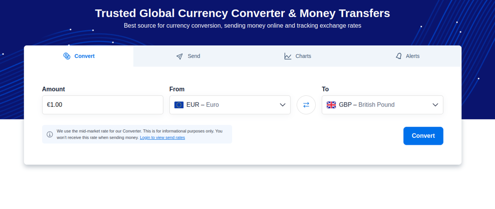

## About

Repository of Playwright Automation Technical Assessment

## Stacks

- Playwright
- TypeScript
- Allure Reports

## Running

#### Observations

```
 In order to see the GitHub Actions running I recomend forking the project first.
 Then clone it from your github forked link.
```

1. Clone the GitHub Repo and install dependencies

```
git clone https://github.com/manoellvitor/e2e-pw-xe-currency.git
cd e2e-pw-xe-currency
npm install
```

2. Run the tests

```
npm run tests
```

3. Check the Allure reports

```
npm run allure-report
```

4. Check the Playwright Reports

```
npx playwright show-report
```

<hr>
